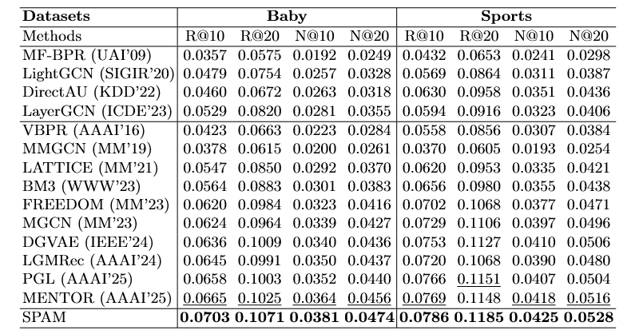

# SPAM: Semantic Preference Prototype and Anchor-enhanced Multimodal Recommendation

<!-- PROJECT LOGO -->

## Introduction

This is the Pytorch implementation for our SPAM paper:

>SPAM: Semantic Preference Prototype and Anchor-enhanced Multimodal Recommendation

## Environment Requirement
- python 3.10
- Pytorch 2.1.0

## Dataset

We provide two processed datasets: Baby, Sports.

Download from Google Drive: [Baby/Sports/Clothing](https://drive.google.com/drive/folders/1tU4IxYbLXMkp_DbIOPGvCry16uPvolLk)
## Training
  ```
  cd ./src
  python main.py -m SPAM -d baby
  ```
## Performance Comparison


## Acknowledgement
The structure of this code is  based on [MMRec](https://github.com/enoche/MMRec). Thank for their work.
